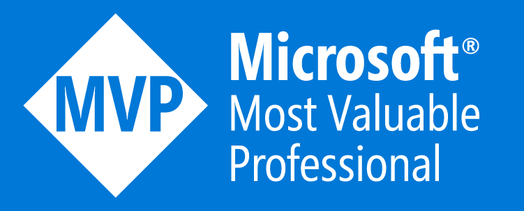

## About Me:
Hi there 👋
 🙋‍♂️Just a standard human being and a typical dev that likes to code.
 🤩 I am a Microsoft MVP in M365 Development
 ⭐ I am one of the community initiative coordinators of the [Microsoft 365 & Power Platform Community (PnP Team)](https://pnp.github.io/#team) #CommunityRocks
 💪 I am a maintainer of [CLI for Microsoft 365](https://github.com/pnp/cli-microsoft365). Let me know if you need any guidance or help related Microsoft 365 (not only CLI 😉).
 👾 I am a maintainer of [SharePoint Framework Toolkit for Visual Studio Code](https://github.com/pnp/vscode-viva). I love creating tools that help out other devs. 
 👨‍💻 I like to code for the community by supporting PnP Open Source projects/repos. [Usually things for SharePoint and Microsoft 365.](https://adoption.microsoft.com/en-us/sample-solution-gallery/Adam-it/) and [create solutions that support devs in VS Code](https://marketplace.visualstudio.com/publishers/adamwojcikit)
 ✍️ Besides coding I try a bit of blogging by contributing the little knowledge that I have to [PnP Blog](https://pnp.github.io/blog/)
 🌈 [#include `<everyone>`](https://accessibilityinsights.io/)
 👉 If you like my work or find it helpful let me know 👠

<a href="https://mvp.microsoft.com/en-US/mvp/profile/fad4153e-1e9e-ed11-83ff-000d3a5600fa">
 MVP profile</a>

## 🌐 Socials:

## 💻 Tech Stack:

🌐 Microsoft 365, SharePoint Online, Azure
 👨‍💻 C#, VB, TypeScript, JavaScript, PowerShell, , php, css, HTML, T-SQL
 👨‍💻 React, Blazor, MVC... and a loooot more 😉
 🛠️ Visual Studio, Visual Studio Code, Microsoft Power Platform 
 🚀 Azure DevOps, GitHub Workflows

## 📊 GitHub Stats:
 
 

---

  
